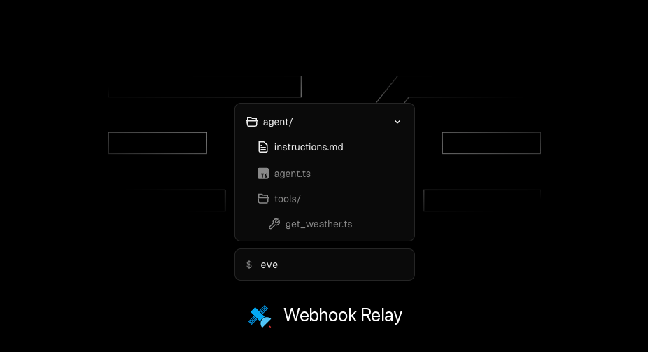
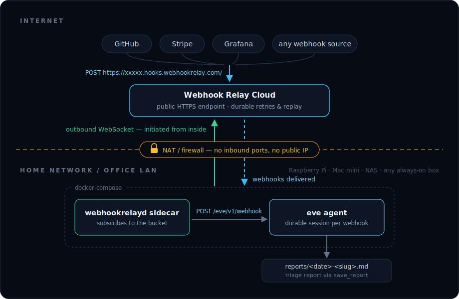

# Webhook-triggered eve agent on your own hardware

An example [eve](https://vercel.com/eve) AI agent that runs on private
infrastructure — a Raspberry Pi, a Mac mini, a NAS, a VM behind a corporate
firewall — and is triggered by webhooks from anywhere on the internet,
**without opening a single inbound port**.



[Webhook Relay](https://webhookrelay.com) provides the stable public HTTPS
endpoint. The `webhookrelayd` sidecar in this repo's docker-compose keeps an
*outbound* connection to it and delivers every webhook to the agent over the
internal compose network:



The example agent is a **webhook triage agent**: for every event it receives
(a GitHub issue, a Stripe payment failure, a monitoring alert, any JSON) it
figures out what happened, assigns a severity and writes a short markdown
triage report via its `save_report` tool. The interesting part is the wiring —
swap the instructions and tools for whatever you want to happen when a webhook
arrives.

## The moving parts

| File | What it does |
|---|---|
| `agent/agent.ts` | Model config — Claude via Lightning AI's Anthropic-compatible API (any AI SDK provider works) |
| `agent/instructions.md` | The agent's system prompt: how to triage events |
| `agent/channels/webhook.ts` | HTTP channel: `POST /eve/v1/webhook` starts a fresh agent session per webhook |
| `agent/tools/save_report.ts` | Typed tool the model calls to write the report |
| `docker-compose.yml` | The agent + the `webhookrelayd` sidecar |

## Quick start

Prerequisites: Docker, a free [Webhook Relay account](https://my.webhookrelay.com),
and an LLM API key (this example uses [Lightning AI](https://lightning.ai)'s
Anthropic-compatible endpoint; edit `agent/agent.ts` for other providers).

**1. Create the bucket and output.** At
[my.webhookrelay.com/buckets](https://my.webhookrelay.com/buckets) create a
bucket called `eve-agent-example`, then add an output with destination:

```text
http://agent:3000/eve/v1/webhook
```

and mark the output as **internal** so it is delivered by your `webhookrelayd`
agent rather than from the cloud. `agent` is the docker-compose service name —
the hostname only needs to resolve inside the compose network. Note the
bucket's public input URL (`https://xxxxx.hooks.webhookrelay.com/`).

**2. Configure the environment.** Get a token at
[my.webhookrelay.com/tokens](https://my.webhookrelay.com/tokens), then:

```bash
cp .env.example .env.local
# fill in LIGHTNING_API_KEY, RELAY_KEY, RELAY_SECRET
```

**3. Run it:**

```bash
docker compose up --build -d
```

**4. Send a webhook** to the bucket's public input URL from anywhere:

```bash
curl -X POST https://xxxxx.hooks.webhookrelay.com/ \
  -H 'content-type: application/json' \
  -H 'x-github-event: issues' \
  -d '{"action":"opened","issue":{"number":42,"title":"Payments webhook drops events during deploys","html_url":"https://github.com/acme/shop/issues/42"},"repository":{"full_name":"acme/shop"},"sender":{"login":"octocat"}}'
```

A few seconds later the agent has written its triage report:

```bash
cat reports/*.md
```

Point GitHub, Stripe, Shopify or your monitoring at the same input URL and
every event flows through to the agent — the machine it runs on stays
invisible to the internet.

## Local development (no Docker)

With Node 24+:

```bash
npm install
npm run dev        # eve dev TUI; reads .env.local
```

Then in another terminal, deliver a webhook straight to the channel:

```bash
curl -X POST http://127.0.0.1:3000/eve/v1/webhook \
  -H 'content-type: application/json' \
  -d '{"test":"hello"}'
```

Or skip the manual curl entirely and forward the real bucket to your dev
server with the [relay CLI](https://webhookrelay.com/docs/installation/cli/):

```bash
relay forward --bucket eve-agent-example http://127.0.0.1:3000/eve/v1/webhook
```

## Hardening notes

- Set `WEBHOOK_SECRET` in `.env.local` and configure your relay/output to send
  the `x-webhook-secret` header if you want the channel to reject anything
  that didn't come through your bucket.
- The compose file maps the agent's port to the host (default `3900`) for
  health checks and curl tests only — remove the `ports:` section for a fully
  closed box.
- Enable [durable retries](https://webhookrelay.com/features/durable-retries/)
  on the bucket if the agent host is a machine that sleeps, reboots or loses
  connectivity: events queue in the cloud and deliver when it reconnects.

## Read more

- Blog post: [Trigger a self-hosted AI agent with webhooks — on a Raspberry Pi or Mac mini](https://webhookrelay.com/blog/self-hosted-ai-agent-webhooks/)
- [eve framework docs](https://vercel.com/eve)
- [Webhook Relay docs](https://webhookrelay.com/docs/)
